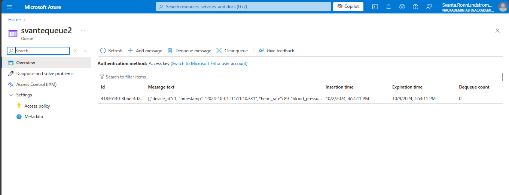
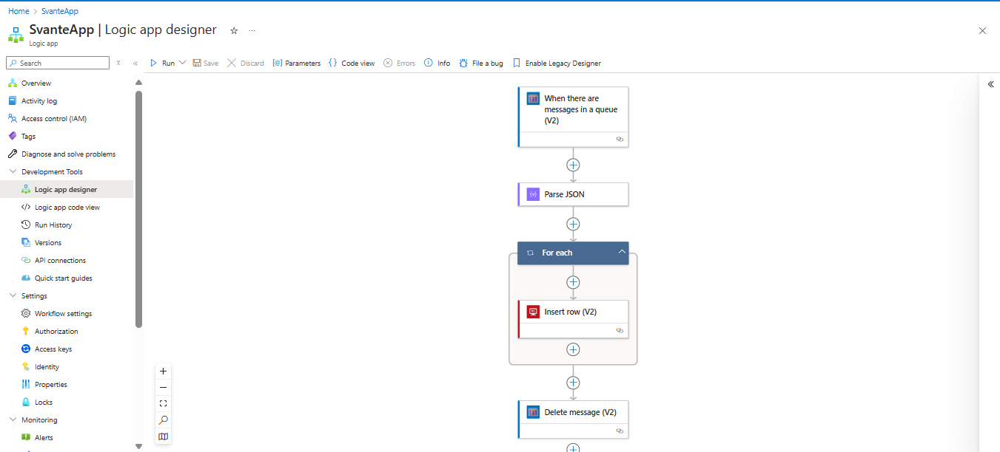
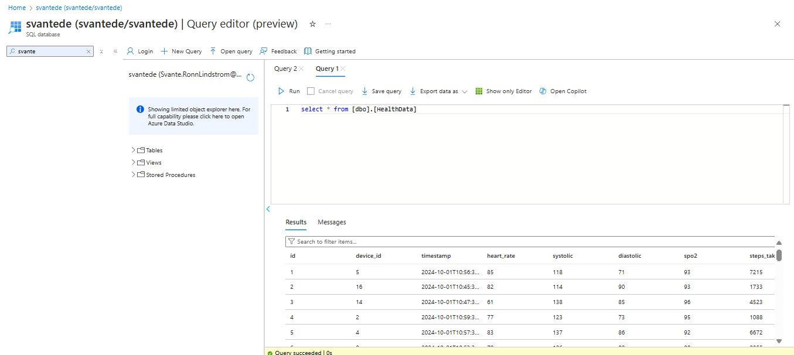
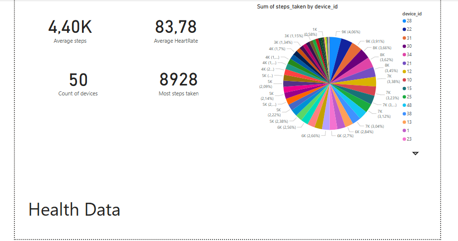
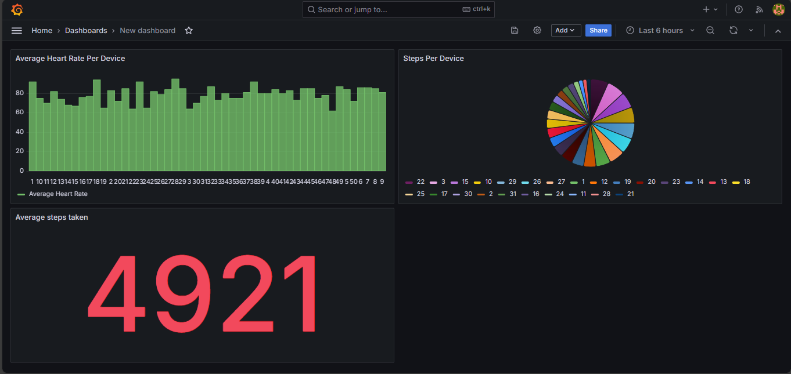
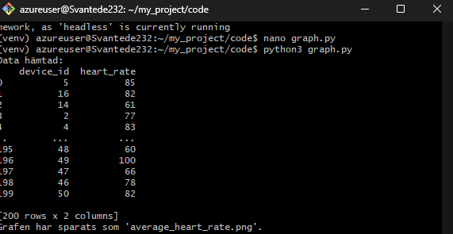
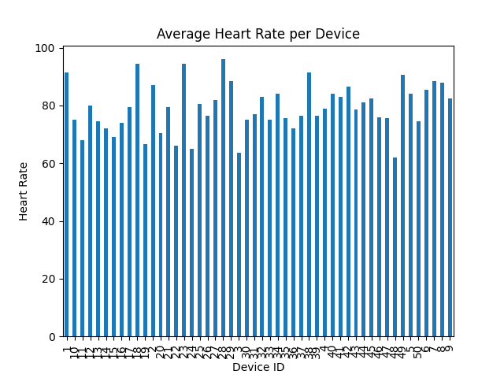

Jag började uppgiften med att skapa python koden "health_data.py" för att få min JSON fil. 
Koden och JSON-filen finns i mitt repo.
Sedan skickade jag in koden till min queue med koden "upload_to_azure.py".
Här kan du se min queue: 

När datan finns i min queue skickar jag vidare från queue till databasen med hjälp av Logic app:

Här är en bild på att jag kan se min data i min databas:

Sedan använder jag min data för att visualisera lokalt med Power BI:

Jag använder även grafana i en VM för att visualisera:

Jag skapar sedan en matplotlib i en VM men får den tyvärr inte att visualisera genom min VM utan istället så hämtar jag
en bild från min VM på Matplotlib grafen. Här kommer två bilder, ena på att jag kör koden i VM och sedan en bild på grafen.

